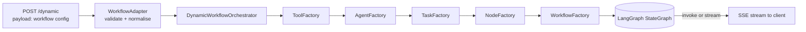

# SmartHire: config-driven agent workflows

A small workflow engine on top of **LangGraph** and **CrewAI** where agents, tasks, tools, nodes and the graph itself are declared in YAML and assembled by factories at request time. The shipped example turns a candidate's resume into interview questions and emails them, streaming progress to a UI.

The point of the project is the engine, not the demo: adding a new workflow means editing configuration, not Python.


## How a request becomes a graph



1. **Adapter** (`src/adapters/`) checks the request shape and merges it with the registries under `src/*/**_registry/*.yaml`.
2. **Factories** build CrewAI `Tool`, `Agent` and `Task` objects from their YAML entries. Nothing is instantiated until a node needs it.
3. **Nodes** (`src/nodes/`) wrap execution units:
   - `crew` — a CrewAI crew of one or more agents and tasks; the crew's raw output is written to the node's `output_field` (parsed as JSON when the field is typed `dict`).
   - `ai` — a single LLM call from a prompt template rendered with the current state. For classification, extraction or rewriting steps that do not need a crew.
   - `functional` — plain Python handlers under `src/handlers/nodes/`, used for conditions and glue.
4. **Workflows** (`src/workflows/components/`) turn node lists into a `StateGraph`:
   - `linear` — `edges` as `from_node -> next_node`.
   - `parallel` — an edge whose `next_node` is a list fans out; one whose `from_node` is a list fans in, and LangGraph waits for every branch.
   - `conditional` — `conditions` route on the return value of a functional handler (for example `check_node_output` → `continue` / `end`).
5. **State** is a `TypedDict` built at runtime from the `state_fields` of the nodes actually in the workflow (`BaseWorkflow.build_state`), plus bookkeeping keys (current node, previous node, last output). Every field uses a last-writer-wins reducer and every node is wrapped so it returns only the keys it changed, which is what lets parallel branches merge instead of overwriting each other.

## Example: the interview-question workflow

```yaml
# nodes (src/nodes/nodes_registry/nodes.yaml)
pdf_text_extraction:
  type: crew
  agents: [pdf_text_extract_agent]
  tasks: [pdf_text_extract_task]
  inputs: {pdf_file_path: str}
  state_fields: {pdf_text_extract_output: str}
  output_field: pdf_text_extract_output

interview_qn_generation:
  type: crew
  agents: [interview_question_generation_agent]
  tasks: [interview_question_generation_task]
  state_fields: {interview_qns_output: str}
  output_field: interview_qns_output

send_email:
  type: crew
  agents: [email_send_agent]
  tasks: [email_send_task]
  inputs: {recipient: str}
  state_fields: {mail_status_output: str}
  output_field: mail_status_output
```

```yaml
# workflow (sent in the request payload or defined under src/templates/)
dynamic_workflow:
  workflow_type: conditional
  nodes: [{name: pdf_text_extraction}, {name: interview_qn_generation}, {name: send_email}, {name: stop_execution}]
  conditions:
    - {from_node: pdf_text_extraction, condition: check_node_output,
       paths: {continue: interview_qn_generation, end: stop_execution}}
  edges:
    - {from_node: interview_qn_generation, next_node: send_email}
  entry_point: pdf_text_extraction
  finish_point: send_email
```

An `ai` node that summarises the resume before question generation would be:

```yaml
resume_summary:
  type: ai
  prompt: "Summarise this resume in three bullet points:\n{pdf_text_extract_output}"
  state_fields: {resume_summary: str}
  output_field: resume_summary
```

## Running it

```bash
python -m venv .venv && source .venv/bin/activate
pip install -r requirements.txt
cp .env.example .env            # choose the LLM provider and fill in tool keys
python app.py                   # Flask API on :5001
```

```bash
curl -X POST localhost:5001/dynamic -H 'content-type: application/json' \
     -d '{"stream": "true", "payload": { ...workflow config... }}'
```

`LLM_PROVIDER` selects the model for every agent and AI node: `ollama` (default, local), `openai`, or `groq`. Set `WORKFLOW_GRAPH_IMAGE=graph.png` to have each compiled graph rendered as a PNG.

## Tests

```bash
pytest -q          # 11 tests, no model or network needed
```

The tests exercise the engine with fake nodes: state construction from node config, node-type dispatch, prompt rendering in `ai` nodes, and linear, parallel (fan-out and fan-in) and conditional graph execution end to end through LangGraph. CI runs them on every push.

## Screenshots and demo

| | |
|---|---|
| Text extraction |  |
| Question generation |  |
| Email agent |  |

Screen recordings: [Google Drive](https://drive.google.com/file/d/1pjPbhxTma0Qo2r09JSNlb7-SYtct4g-B/view?usp=sharing) or the [demo-videos release](https://github.com/kiran-bal/smarthire-agent-workflows/releases/tag/demo-videos).

## Project structure

```
app.py                         Flask entry point
config/, config_mgr/           application config loading
constants/                     state and config key names
src/
├── adapters/                  request → normalised workflow config
├── agents/  tasks/  tools/    CrewAI factories + YAML registries
├── nodes/                     crew / ai / functional nodes, NodeFactory
├── handlers/nodes/            functional handlers (conditions, stop)
├── entities/states/           dynamic TypedDict state builder
├── workflows/                 linear / parallel / conditional graphs, WorkflowFactory
├── managers/  builders/       email (SendGrid) and template helpers
├── services/  api/            Flask service and blueprint
└── templates/dynamic/         example workflow templates
tests/                         engine tests with fake nodes
```

## Limitations

- Crew nodes return raw text; structured outputs depend on the prompt asking for JSON and `state_fields` typing the field as `dict`.
- No retry or timeout policy per node yet; a hung tool call hangs the workflow.
- Parallel branches must write distinct output fields; a shared key is last-writer-wins by design.
